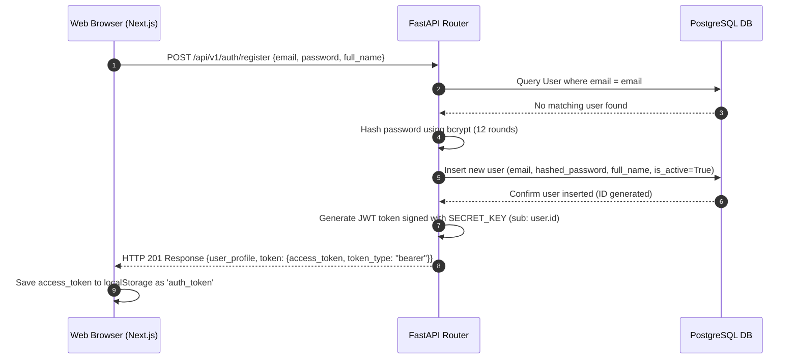
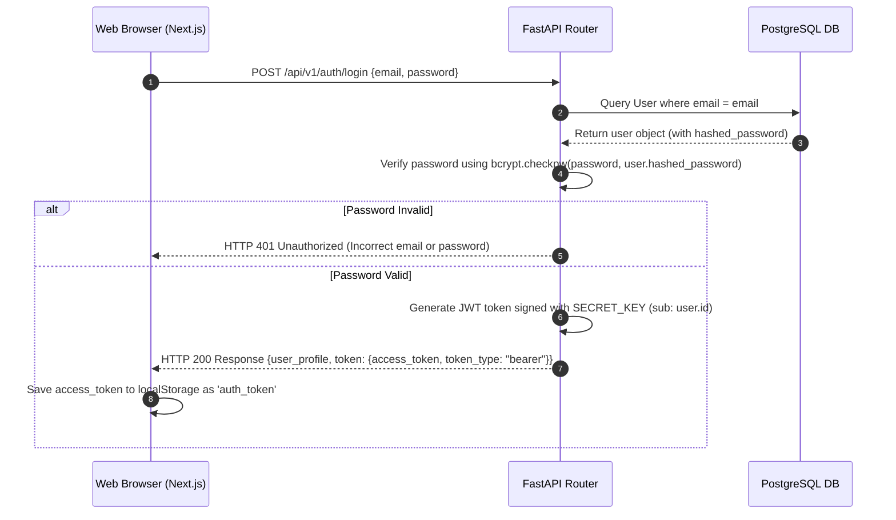
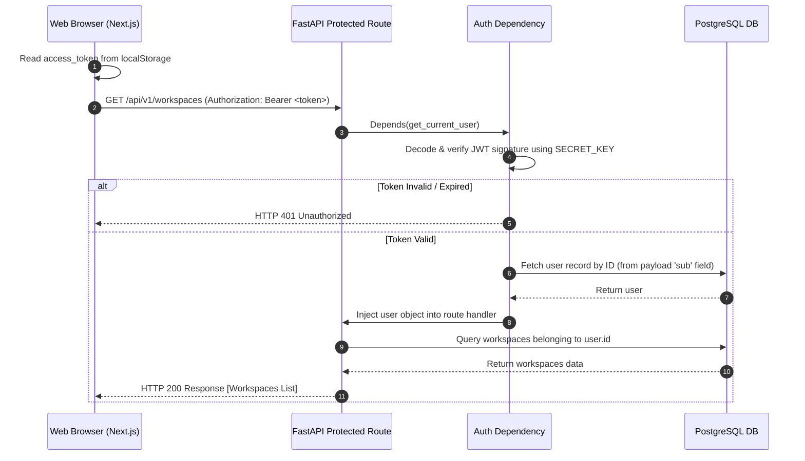
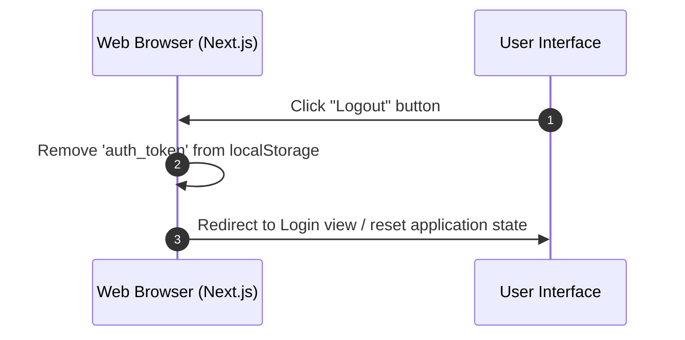

# User Authentication & Login Architecture

This document describes how authentication and login are designed and implemented in the **Agreement AIQ** platform, detailing the tech stack, credential storage, and end-to-end data flows.

---

## 🛠️ Authentication Tech Stack

The platform implements a **stateless, token-based authentication** system using the following technologies:

| Layer | Component / Library | Purpose |
| :--- | :--- | :--- |
| **Frontend Storage** | Browser `localStorage` | Client-side session persistence |
| **API Client** | Next.js Fetch API | HTTP requests with Bearer token headers |
| **Backend Framework** | FastAPI (Python) | High-performance async routing and auth dependency injection |
| **Token Standards** | JWT (JSON Web Tokens) | Stateless bearer token standard for secure identity transmission |
| **Token Encoding/Signing** | `python-jose` (HS256) | Generation and signature verification of JWT payloads |
| **Cryptography** | `bcrypt` (12 rounds) | Secure password hashing |
| **Database** | PostgreSQL | Relational storage for user accounts |
| **ORM** | SQLAlchemy | Object-relational mapping for the `users` table |

---

## 💾 Credential & Session Storage

### 1. Password Hashing (Database Storage)
Plaintext passwords are **never** stored in the database, printed in logs, or cached in Redis.
- When a user registers, the password is hashed in [backend/src/core/auth.py](file:///e:/Agreement%20AIQ/backend/src/core/auth.py) using `bcrypt.hashpw()` with a salt work factor of **12 rounds**.
- The resulting hash is stored in the `hashed_password` column of the `users` table in the PostgreSQL database.
- See the [User Model](file:///e:/Agreement%20AIQ/backend/src/models/user.py) for the schema.

### 2. Client-Side Token Storage (Session Persistence)
- Upon successful login/registration, the API server returns a JWT access token.
- The frontend client [frontend/lib/api.ts](file:///e:/Agreement%20AIQ/frontend/lib/api.ts) receives this token and stores it in the browser's **`localStorage`** under the key **`auth_token`**.
- This token is read from `localStorage` whenever the client loads, maintaining the user session across browser refreshes.

### 3. Signing Secret (Backend Configuration)
- JWT validation is signed using a cryptographic `SECRET_KEY` defined in the server's `.env` environment variables.
- The server uses `HMAC-SHA256` (`HS256`) to sign the token. Any modification to the payload by the client makes the signature invalid.

---

## 🔄 Authentication Flows

### 1. User Registration Flow

### 2. User Login Flow

### 3. Making Authenticated Requests

### 4. Logout Flow

---

## 📂 Code Files Index

You can inspect the implementation in the following codebase files:

### Backend Implementation
* **[backend/src/core/auth.py](file:///e:/Agreement%20AIQ/backend/src/core/auth.py)**: Cryptographic functions (`get_password_hash`, `verify_password`), token issuance (`create_access_token`), and dependency helper functions (`get_current_user`, `get_current_user_optional`).
* **[backend/src/api/auth.py](file:///e:/Agreement%20AIQ/backend/src/api/auth.py)**: REST API routes exposing `/register`, `/login`, `/me`, and `/refresh` endpoints.
* **[backend/src/models/user.py](file:///e:/Agreement%20AIQ/backend/src/models/user.py)**: Database model definitions for the `users` table including indexes and relationships.

### Frontend Implementation
* **[frontend/lib/api.ts](file:///e:/Agreement%20AIQ/frontend/lib/api.ts)**: Implements `ApiClient` class managing the session token, reading/writing from/to browser `localStorage` in `setToken()`, attaching `Authorization: Bearer <token>` to requests, and making HTTP requests for user operations.
